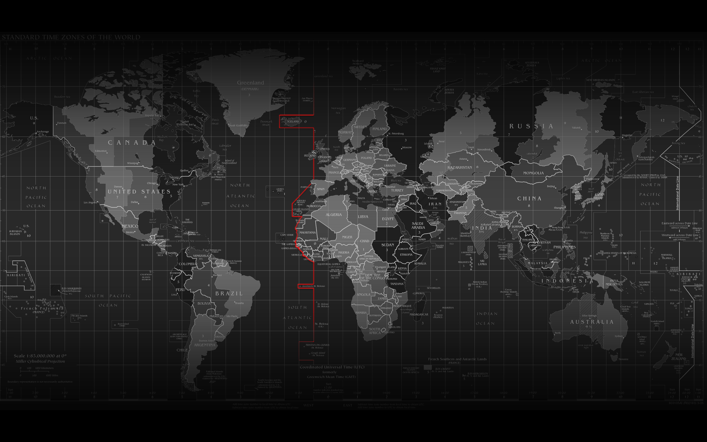

class: inverse
# Mi primer diapositiva

names(xaringan:::list_css()) para fuentes y fondos.

xaringan::inf_mr() para que salga en el viewer.
install.packages("iconr") para iconos.

install.packages("devtools") para iconos.

investigar que paquete es el que se 
requiere icon no esta en el cran.

- lista 1
- lista 2
---
Segunda diapositiva 

`icon::fa("laptop-code")`


```{python, echo =FALSE}
print("Hello world")
```

```{r, echo=FALSE, print = FALSE}
library(tidyverse)
```

```{r, echo=FALSE}
head(mtcars) %>% 
  knitr::kable()
```
---
# links en las diapositivas
- simplemente poner el link. 
https://fontawesome.com/icons/file?s=regular&f=classic

- usar sintaxis de Rmarkdown
[link a fontawesome](https://fontawesome.com/icons/file?s=regular&f=classic)

- usar sintaxis de HTML con 
<a href="https://fontawesome.com/icons/file?s=regular&f=classic">Link fontawesome<a/>
---
# graficos en la presentación con R

```{r, echo=FALSE}
gss_cat %>% 
  count(rincome) %>% 
  filter(!rincome == "Not applicable") %>% 
  mutate(rincome = fct_reorder(rincome, n)) %>% 
  ggplot(aes(
    rincome,
    n,
    fill = rincome
  ))+
  geom_col(show.legend = FALSE)+
  coord_flip()
```
---
# Diapositiva con imagenes desde la computadora
- Estilo markdown

---
# Diaposiva con imagenes desde la computadora II
- Estilo CSS, da opción a cambiar el tamaño de la imagen.


---
# Diapositivas con imagenes desde internet

- distribución normal.


---
background-image: url(https://media.giphy.com/media/K1tgb1IUeBOgw/giphy.gif)
# Imagen de internet
Aquí ponemos una imagen de fondo con estilo Rmarkdown
<br/><br/>
Esta es otra imagen, pero con estilo HTML
---
# Otra grafica desde R

```{r, echo=FALSE}
gss_cat %>% 
  filter(!is.na(age)) %>% 
  count(age, marital) %>% 
  group_by(age) %>% 
  mutate(prom = n / sum(n)) %>% 
  ggplot(aes(
    age,
    prom,
    colour = marital
  ))+
  geom_line(na.rm = TRUE)+
  theme(legend.position = "bottom")

```
---
# dividir la diapositiva en 2
.pull-left[
```{r, echo=FALSE}
gss_cat %>% 
  filter(!is.na(age)) %>% 
  count(age, marital) %>% 
  group_by(age) %>% 
  mutate(prom = n / sum(n)) %>% 
  ggplot(aes(
    age,
    prom,
    colour = marital
  ))+
  geom_line(na.rm = TRUE)+
  theme(legend.position = "bottom")
```
]

.pull-right[
```{r, echo=FALSE}
gss_cat %>% 
  filter(!is.na(age)) %>% 
  count(age, marital) %>% 
  group_by(age) %>% 
  mutate(prom = n / sum(n)) %>% 
  ggplot(aes(
    age,
    prom,
    colour = marital
  ))+
  geom_line(na.rm = TRUE)+
  theme(legend.position = "bottom")
```
]
---
# Ejemplo de cómo poner una ecuación
$$S (ω)=1.466\, H_s^2 \,  \frac{ω_0^5}{ω^6 }  \, e^[-3^ { ω/(ω_0  )]^2}$$
---
FIN

```{r eval=FALSE, print=FALSE}
#Convertimos a pdf con
pagedown::chrome_print("presentacion.html")
```


